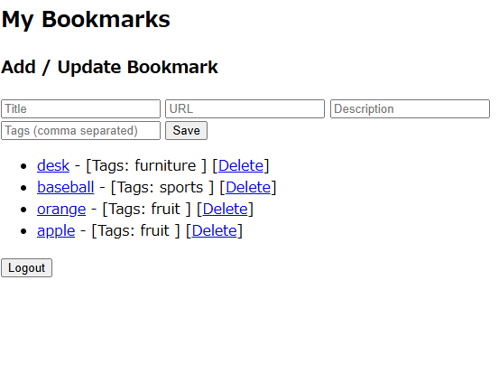

# ブックマーク管理アプリ

デモサイト:https://bookmark3.onrender.com/

試用アカウント:

ユーザー名: raguna

パスワード: kaibasensei

### 概要

バックエンド開発力を証明するために設計・構築したブックマーク管理アプリです。

主な特徴:

ユーザーごとのブックマーク管理

タグによる分類・整理

REST API + Django標準ビューの二重構成

JWT認証による安全なAPIアクセス

単体テストカバレッジ100%

Renderによる自動デプロイ対応

アプリ画面例:

### 技術スタック

バックエンド: Python / Django / Django REST Framework

認証: Djangoセッション（Web） + JWT（API）

データベース: SQLite（開発用） / PostgreSQL（本番想定）

テスト: pytest, pytest-django（モデル・ビュー・APIを網羅、カバレッジ100%）

デプロイ: Docker + Render

静的ファイル: Whitenoise（簡易配信）

フロント: 最小限のHTMLテンプレート（login.html, bookmarks.html）

### 主な機能
Web画面（セッション認証）

ログイン / ログアウト

ブックマーク一覧表示

新規作成・更新・削除

タグの追加・表示（多対多関係活用）

API（REST / JWT認証）

/api/bookmarks/ でCRUD操作

APIクライアントから認証付きでデータ操作可能

### テスト

モデル・ビュー・APIを網羅

単体テストカバレッジ100%

pytestで自動テスト実行

### 特徴・アピールポイント

自走力: Docker環境構築 → CI（pytest） → Render自動デプロイまで自力で構築

設計力: CRUD処理の分岐や get_object_or_404 など、セキュリティ・データ整合性を意識

データモデル理解: Bookmark-Tagの多対多関係を正しく活用

テスト駆動: モデル・ビュー・API単体テストを網羅、カバレッジ100%

スピード感: 短期間で主要機能完成 → 即運用可能な状態でリリース

### デプロイ

Render上でDockerコンテナを用いた自動デプロイ

環境変数で DJANGO_SECRET_KEY / ALLOWED_HOSTS を管理

プッシュ時にテスト通過で自動デプロイ

### 今後の改善予定

タグによるフィルタリング機能を追加し、ブックマーク一覧の閲覧性を向上予定